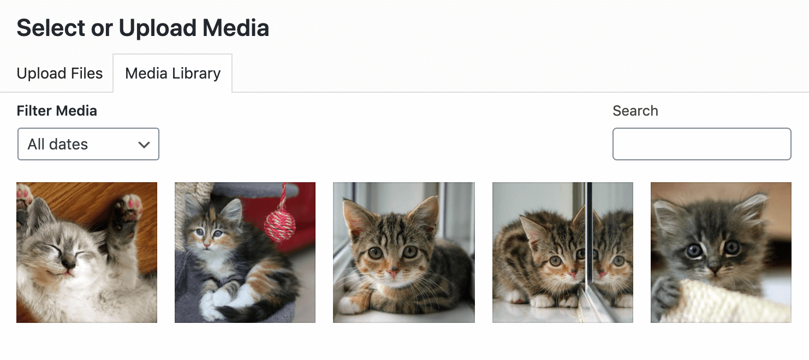

# Asset Manager Framework

This WordPress plugin provides a framework for replacing the contents of the standard WordPress media library with assets from an external provider, such as a DAM.

It handles the necessary integration with WordPress (Ajax endpoints and Backbone components) leaving you to focus on the API connection to your DAM.

The intention is that the media manager, the block editor, the classic editor, the REST API, and anything that calls `wp.media()` should "just work" and not need to implement changes in order to support a media library that is powered by an external provider.

## Status

Current status: **MVP.** This is not yet ready for production use.

The following features work as expected:

* [X] Block editor: Image block (including its derivatives such as Cover, Media & Text, Inline image)
* [X] Block editor: Gallery block
* [X] Block editor: Video block
* [X] Block editor: Audio block
* [X] Block editor: File block
* [X] Block editor: Featured image
* [X] Classic editor: Images and image galleries
* [X] Classic editor: Videos and video playlists
* [X] Classic editor: Audio and audio playlists
* [X] Classic editor: Featured image
* [X] Classic editor: Other file types
* [X] Media screen: List mode
* [X] Media screen: Grid mode
* [X] Media screen: Grid attachment details
* [X] Attachment editing screen

The following plugins have been tested and are known to be compatible:

* [X] CMB2
* [X] Advanced Custom Fields (ACF)
* [X] Fieldmanager

The following features are not yet supported:

* [ ] Deep linking to the media screen grid attachment details
* [ ] Setting the featured image for a non-image media item automatically, when one is available (eg. video poster)
* [ ] Responsive image srcsets on images within post content

The following new features are planned but not yet implemented:

* [ ] Various degrees of read-only media (to prevent local uploading, editing, cropping, or deletion)

The following features will *not* be supported:

* Side-loading media from an external media provider. The intention of this framework is that media files remain remotely hosted.
* Built-in handling of authentication required to communicate with your external media provider. This responsibility lies within your implementation. Consider using [the Keyring plugin](https://wordpress.org/plugins/keyring/) if an OAuth connection is required.
* Built-in support for any given media provider (such as Resource Space, AEM, or Bynder). This is a framework built to be extended in order to connect it to a media provider.

## Implementation

There are two main parts to the way this plugin works.

1. Allowing the media manager grid to display external items which are not existing attachments.
2. Subsequently creating a local attachment for an external item when it's selected for use.

The design decision behind this is that allowing for external items to be browsed in the media manager is quite straight forward, but unless each item is associated with a local attachment then most of the rest of WordPress breaks when you go to use an item. Previous attempts to do this have involved lying about attachment IDs, or switching to another site on a Multisite network to provide a media item. Neither approach is desirable because such lies need to be maintained and eventually you run into a situation where your lies become unravelled.

Asset Manager Framework instead allows external media items to be browsed in the media library grid, but as soon as an item is selected for use (eg. to be inserted into a post or used as a featured image), an attachment is created for the media item, and this gets returned by the media manager.

The actual media file does not get sideloaded into WordPress - it intentionally remains at its external URL. The correct external URL gets referred to as necessary, while a local object attachment is maintained that can be referenced and queried within WordPress.

## Integration

There are two steps needed to integrate a media provider using the Asset Manager Framework:

1. Create a provider which extends the `AssetManagerFramework\Provider` class and implements its `request()` method to fetch results from your external media provider based on query arguments from the media manager.
2. Hook into the `amf/provider_class` filter to register your provider for use.

Full documentation is coming soon, but for now here's an example of a provider which supplies images from placekitten.com:

```php
use AssetManagerFramework\{
	Provider,
	MediaList,
	Image,
};

class KittenProvider extends Provider {

	protected function request( array $args ) : MediaList {
		$kittens = [
			500 => 'Boop',
			600 => 'Fuzzy',
			700 => 'Paws',
		];
		$items = [];

		foreach ( $kittens as $id => $title ) {
			$item = new Image( $id, 'image/jpeg' );
			$item->set_url( sprintf(
				'https://placekitten.com/%1$d/%1$d',
				$id
			) );
			$item->set_title( $title );
			$item->set_width( $id );
			$item->set_height( $id );

			$items[] = $item;
		}

		return new MediaList( ...$items );
	}

}

add_filter( 'amf/provider_class', function() {
	return 'KittenProvider';
} );
```

Try it and your media library will be much improved:



# License: GPLv2 #

This program is free software; you can redistribute it and/or modify
it under the terms of the GNU General Public License as published by
the Free Software Foundation; either version 2 of the License, or
(at your option) any later version.

This program is distributed in the hope that it will be useful,
but WITHOUT ANY WARRANTY; without even the implied warranty of
MERCHANTABILITY or FITNESS FOR A PARTICULAR PURPOSE.  See the
GNU General Public License for more details.
